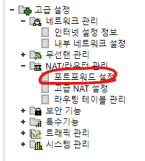
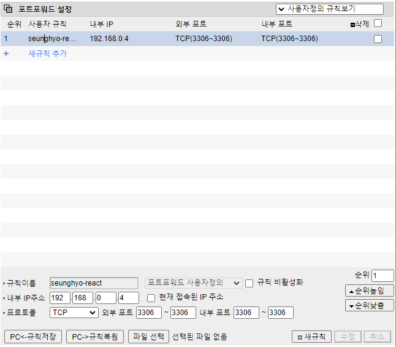

# SeungHyo

백준과 유사한 알고리즘 사이트

## 프로젝트 레포 구조

[SeungHyo-Frontend](https://github.com/akak4456/SeungHyo-Frontend.git): 승효 프로젝트의 프론트엔드를 담당함. 리액트로 구현하였음.

[SeungHyo-Backend](https://github.com/akak4456/SeungHyo-Backend.git): 승효 프로젝트의 백엔드를 담당함.

[SeungHyo-DockerCompose](https://github.com/akak4456/SeungHyo-DockerCompose.git): 승효 프로젝트를 서버에 배포할 때 필요한 docker-compose 파일들을 정의함

## release 서버 변경사항 반영하기

GIT BASH 등에서

```
sh prod-deploy.sh v[버전명]
```

과 같이 셸 스크립트를 실행한다.

## release 서버 설정 및 서비스 구동 방법

### 방화벽 포트 뚫기(인바운드 규칙 추가)

- 포트 번호를 사용하기 위해서는 방화벽 포트를 뚫어야 한다. Windows 같은 경우는 [링크](https://m.blog.naver.com/zeboll/221134011377) 를 참조하고 Ubuntu 는 다른 사이트를 참고하도록 하자

### Docker 설치

- SeungHyo 앱은 Docker 로 배포가 된다. 따라서 Docker 를 설치해야 한다. Ubuntu 같은 경우는 Docker 뿐만 아니라 Docker Compose 도 설치해야 하는 것으로 알고 있다.

### iptime 포트 포워딩(공유기를 이용하는 경우)

- 공유기를 이용하는 경우 방화벽 포트 뚫기만 해서는 안된다. iptime 포트 포워딩도 진행해야 한다.

1. 192.168.0.1 로 접속한다.
   
2. 포트포워딩 설정으로 접속한다.
   
3. 그림과 같이 내부 IP 주소(ipconfig를 통해 알아낼 수 있는 이더넷 주소?) 외부 포트(아무거나 지정해도 상관은 없음 편의상 3306 으로 지정함) 내부 포트(react 앱이 3306을 통해서 배포됨)을 지정한 후에 저장한다.
   
4. 그렇다면 기본 설정>시스템 요약 정보에 확인할 수 있는 외부 IP 주소를 이용해서 접근이 가능하다. 좀 구체적으로는 외부 IP 주소:외부 포트 를 이용해서 접근이 가능하다. 예를 들어 111.118...:3306 을 통해서 접근이 가능하다.

### docker-compose.yml 다운 및 docker compose 실행

[SeungHyo-DockerCompose](https://github.com/akak4456/SeungHyo-DockerCompose.git) 를 통해서 docker-compose.yml 을 다운로드 받고 cd 를 통해 들어간 다음

```
docker-compose up
```

을 실행한다.
