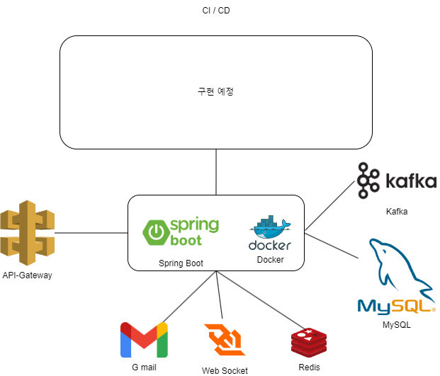

# SeungHyo

백준과 유사한 알고리즘 사이트. 배포법 및 구체적인 문서는 [노션](https://www.notion.so/19e207e64cbd46e88404da1241ddb7c3?pvs=4) 을 참고해주세요

## 프로젝트 git URL

- [프론트엔드](https://github.com/akak4456/SeungHyo-Frontend)
- [백엔드](https://github.com/akak4456/SeungHyo-Backend)

## 프로젝트 아키텍처

### 사용자 흐름도

### 프론트엔드 아키텍처

### 백엔드 시스템 아키텍처

### 백엔드 모듈 아키텍처

- app-eureka 는 app-apigateway, app-board, app-member, app-submit 를 자동으로 찾아서 서비스를 등록해주는 역할을 함
- app-* 같은 경우 하나의 물리서버에 있어도 되지만 여러 물리 서버에 분산해 있어도 상관없게끔 설계되어있음
- DB 같은 경우 MySQL 을 사용하였지만 다른 DB 를 사용하여도 상관없도록 설계함
- app 간의 api 사용은 FeignClient 를 이용하기로 함
- Compile Service 같은 경우는 app-submit 내에 돌아가는 것이며 javac, java 와 같은 프로세스를 실행하는 방식으로 동작함
- Kafka 같은 경우 websocket 의 MQ 역할을 담당하기도 하며 로깅 등에 사용될 예정